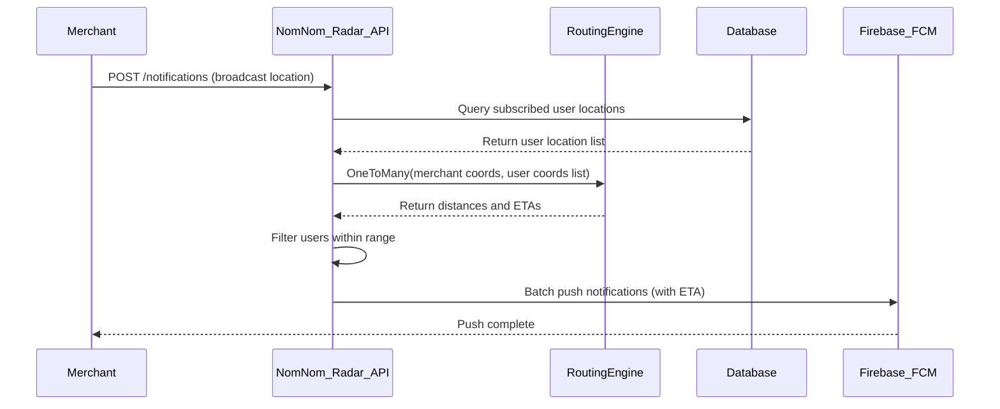
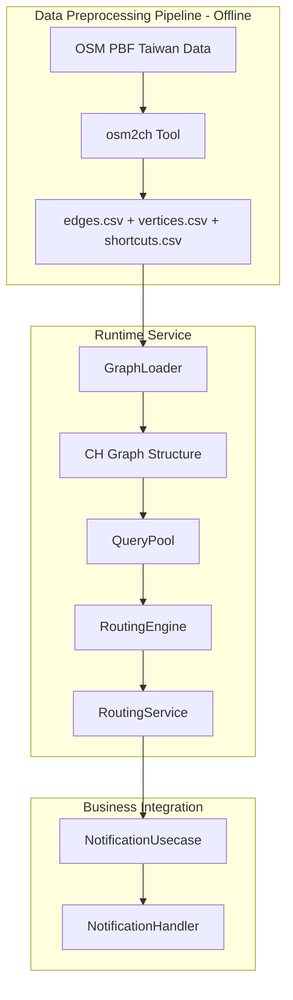
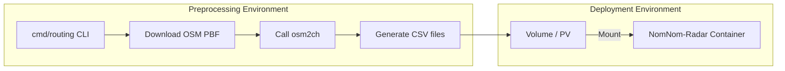

# High-Performance Routing Engine Development Specification

> **Overview**: Integrate the LdDl/ch library into NomNom-Radar to calculate road network distances and ETAs from merchants to all subscribed users when merchants broadcast their location, enabling precise push notifications.

---

## Table of Contents

1. [Business Scenario and System Goals](#1-business-scenario-and-system-goals)
2. [System Architecture](#2-system-architecture)
3. [Core Components Specification](#3-core-components-specification)
4. [Business Integration Design](#4-business-integration-design)
5. [Data Preprocessing Pipeline](#5-data-preprocessing-pipeline-go-cli-tool)
6. [Configuration Design](#6-configuration-design)
7. [Dependencies](#7-dependencies)
8. [Performance Considerations](#8-performance-considerations)
9. [Testing Strategy](#9-testing-strategy)
10. [Development Tasks](#10-development-tasks)
11. [Deployment Configuration](#11-deployment-configuration)

---

## 1. Business Scenario and System Goals

### 1.1 Core Business Flow



### 1.2 System Goals

| Metric | Target |
|--------|--------|
| Query Performance | One-to-Many query (1 merchant → 1000 users) < 50ms |
| Concurrency | Support 100+ QPS routing queries |
| Memory Usage | Taiwan road network graph < 4GB RAM |
| Startup Time | Cold start graph loading < 30 seconds |

---

## 2. System Architecture

### 2.1 Overall Architecture



### 2.2 Directory Structure

```text
cmd/
└── routing/                        # NEW: Routing data preprocessing CLI tool
    └── main.go                     # Go CLI entry point

internal/
├── infra/
│   └── routing/                    # NEW: Routing engine infrastructure layer
│       ├── ch/                     # CH algorithm wrapper
│       │   ├── graph.go            # Graph data structure and loading
│       │   ├── engine.go           # LdDl/ch engine wrapper
│       │   └── query_pool.go       # Concurrent query pool
│       ├── loader/
│       │   └── csv_loader.go       # CSV data loader
│       └── routing_service.go      # RoutingService implementation
├── domain/
│   └── service/
│       └── routing_service.go      # NEW: RoutingService interface definition
├── usecase/
│   └── routing_usecase.go          # OPTIONAL: Routing query usecase interface (for external APIs)
│   └── impl/
│       └── notification_service.go # MODIFY: Integrate routing calculation

config/
└── config.go                       # MODIFY: Add routing configuration

.gitignore                          # MODIFY: Exclude routing data directory
```

### 2.3 Data Management Strategy

> **Important**: Routing data (CSV files) **must NOT be uploaded to Git**. Deploy via volume mounting.



**Data Directory Structure** (not in Git, provided by deployment):

```text
/data/routing/              # Mount point (configurable)
├── edges.csv               # Edge data (~50-100MB)
├── vertices.csv            # Vertex data (~20-50MB)
├── shortcuts.csv           # Shortcut edges (~100-200MB)
└── metadata.json           # Version control metadata
```

### 2.4 Data Version Control

Generate a `metadata.json` file alongside CSV files to track data provenance:

**File**: `metadata.json`

```json
{
  "version": "1.0",
  "source": {
    "region": "taiwan",
    "url": "https://download.geofabrik.de/asia/taiwan-latest.osm.pbf",
    "filename": "taiwan-latest.osm.pbf",
    "size_bytes": 325058560,
    "md5": "a1b2c3d4e5f6...",
    "sha256": "abc123def456...",
    "osm_timestamp": "2025-12-15T00:00:00Z"
  },
  "processing": {
    "generated_at": "2025-12-18T10:30:00Z",
    "osm2ch_version": "1.7.6",
    "cli_version": "0.1.0",
    "profile": "scooter",
    "contraction_enabled": true,
    "tags_included": ["motorway", "trunk", "primary", "secondary", "tertiary", "residential", "service"]
  },
  "output": {
    "vertices_count": 1234567,
    "edges_count": 2345678,
    "shortcuts_count": 3456789,
    "files": {
      "vertices.csv": { "size_bytes": 45678901, "md5": "..." },
      "edges.csv": { "size_bytes": 89012345, "md5": "..." },
      "shortcuts.csv": { "size_bytes": 123456789, "md5": "..." }
    }
  }
}
```

**Note on checksum cost**:

- Computing `md5/sha256` for large outputs (especially `shortcuts.csv`) can take noticeable time.
- Recommended: support a **fast mode** that records only `source.sha256` + `processing.generated_at` + `output.*_count`, and skips per-file checksums unless explicitly requested.

**Benefits**:

| Field | Purpose |
|-------|---------|
| `source.md5` / `sha256` | Verify PBF file integrity, detect corruption |
| `source.osm_timestamp` | Know the age of OSM data |
| `processing.generated_at` | Know when data was preprocessed |
| `processing.profile` | Know which routing profile (car, scooter, bike) |
| `output.*_count` | Quick validation without parsing CSVs |

**Service Startup Logging**:

```go
// Log routing data version on startup
func (e *Engine) logMetadata() {
    meta, err := e.loadMetadata()
    if err != nil {
        e.logger.Warn("Failed to load routing metadata", "error", err)
        return
    }
    
    e.logger.Info("Routing engine initialized",
        "region", meta.Source.Region,
        "osm_timestamp", meta.Source.OSMTimestamp,
        "generated_at", meta.Processing.GeneratedAt,
        "profile", meta.Processing.Profile,
        "vertices", meta.Output.VerticesCount,
        "edges", meta.Output.EdgesCount,
        "shortcuts", meta.Output.ShortcutsCount,
    )
}
```

**.gitignore additions**:

```gitignore
# Routing data (managed via deployment, not git)
/data/routing/
*.osm.pbf
```

---

## 3. Core Components Specification

### 3.1 Domain Layer - Routing Service Interface

**File**: `internal/domain/service/routing_service.go`

```go
package service

import (
    "context"
    "time"

    "github.com/pkg/errors"
)

// Coordinate represents a geographic coordinate
type Coordinate struct {
    Lat float64
    Lng float64
}

// RouteResult represents a routing calculation result
type RouteResult struct {
    SourceIdx   int           // Source index
    TargetIdx   int           // Target index
    Distance    float64       // Road network distance (meters)
    Duration    time.Duration // Estimated travel time
    IsReachable bool          // Whether destination is reachable
}

// ErrSnapDistanceExceeded is returned when coordinate is too far from road network
var ErrSnapDistanceExceeded = errors.New("coordinate too far from road network")

// NearestNodeResult represents the result of finding nearest road network node
type NearestNodeResult struct {
    NodeID      int     // Internal graph node ID (slice index)
    Distance    float64 // Distance from input coordinate to node (meters)
    NodeLat     float64 // Node latitude
    NodeLng     float64 // Node longitude
    IsSnapped   bool    // Whether snap was successful (within MaxSnapDistance)
}

// RoutingService defines the routing calculation service interface
type RoutingService interface {
    // ShortestPath calculates the shortest path between two points
    // Returns ErrSnapDistanceExceeded if either point is too far from road network
    // If the two points are in disconnected components (e.g., Taiwan ↔ Penghu), return IsReachable=false with nil error.
    ShortestPath(ctx context.Context, from, to Coordinate) (*RouteResult, error)
    
    // OneToMany calculates shortest paths from one source to multiple targets
    // This is the core method for merchant notification scenarios
    // Points exceeding MaxSnapDistance are marked as IsReachable: false
    // Disconnected targets are marked as IsReachable: false
    OneToMany(ctx context.Context, from Coordinate, targets []Coordinate) ([]RouteResult, error)
    
    // FindNearestNode finds the nearest road network node to a coordinate
    // Returns ErrSnapDistanceExceeded if distance exceeds MaxSnapDistance config
    FindNearestNode(ctx context.Context, coord Coordinate) (*NearestNodeResult, error)
    
    // IsReady checks if the routing engine is ready
    IsReady() bool
}
```

### 3.2 Infrastructure Layer - CH Engine Wrapper

**File**: `internal/infra/routing/ch/engine.go`

**Core Responsibilities**:

- Wrap `github.com/LdDl/ch` library
- Manage QueryPool lifecycle
- Implement coordinate-to-graph-node mapping (spatial index: KD-tree / grid; library TBD)
- **Validate snap distance** to prevent GPS drift issues
- Provide ETA calculation (distance / average speed)

**Key Implementation**:

```go
// SpatialIndex maps coordinates to nearest vertex/node candidate.
// Implementation can be KD-tree, R-tree, or a custom grid index.
type SpatialIndex interface {
    Nearest(lat, lng float64) (vertexIdx int, ok bool)
}

// Engine wraps the CH routing engine
type Engine struct {
    graph     *ch.Graph           // LdDl/ch graph structure
    queryPool *ch.QueryPool       // Concurrent query pool
    spatial   SpatialIndex        // Spatial index: coordinate → node mapping
    vertices  []Vertex            // Vertex list (with coordinates)
    config    *EngineConfig
}

// EngineConfig engine configuration
type EngineConfig struct {
    QueryPoolSize             int     // QueryPool size, recommended = CPU cores
    DefaultSpeedKmH           float64 // Default speed (km/h) for ETA calculation
    MaxQueryRadius            float64 // Maximum query radius (meters)
    MaxSnapDistance           float64 // Maximum distance to snap GPS to road network (meters)
    OneToManyWorkers          int     // Concurrent workers for One-to-Many (cap to QueryPoolSize)
    PreFilterRadiusMultiplier float64 // Haversine pre-filter multiplier (e.g., 1.3)
}
```

#### 3.2.1 GPS Snap Distance Validation (Critical)

> **Problem**: Nearest-neighbor lookup (KD-tree / spatial index) always returns *some* node, even if it's 50km away (GPS drifted to sea, deep mountains, etc.). This causes incorrect routing.

**Solution**: Validate distance after finding nearest node:

```go
// FindNearestNode finds the nearest road network node with distance validation
func (e *Engine) FindNearestNode(ctx context.Context, coord Coordinate) (*NearestNodeResult, error) {
    // Find nearest using spatial index (KD-tree / grid)
    vertexIdx, ok := e.spatial.Nearest(coord.Lat, coord.Lng)
    if !ok {
        return nil, errors.New("no nodes in spatial index")
    }

    node := e.vertices[vertexIdx]
    
    // Calculate actual distance (Haversine)
    distance := haversine(coord.Lat, coord.Lng, node.Lat, node.Lng)
    
    result := &NearestNodeResult{
        NodeID:   vertexIdx,
        Distance: distance,
        NodeLat:  node.Lat,
        NodeLng:  node.Lng,
    }
    
    // Validate snap distance
    if distance > e.config.MaxSnapDistance {
        result.IsSnapped = false
        return result, ErrSnapDistanceExceeded
    }
    
    result.IsSnapped = true
    return result, nil
}
```

**Snap Distance Guidelines**:

| Environment | Recommended MaxSnapDistance | Reason |
|-------------|----------------------------|--------|
| Urban (台北市區) | 200-500m | Dense road network |
| Suburban (郊區) | 500-1000m | Moderate road density |
| Rural (鄉村) | 1000-2000m | Sparse road network |
| **Default (Taiwan)** | **500m** | Balance between coverage and accuracy |

**Edge Cases Handled**:

| Scenario | GPS Location | Nearest Node | Distance | Result |
|----------|--------------|--------------|----------|--------|
| Normal | 台北車站 | Road node | 50m | ✅ Snapped |
| GPS drift | 台灣海峽 | 基隆港邊緣 | 30km | ❌ ErrSnapDistanceExceeded |
| Remote area | 玉山山頂 | 塔塔加遊客中心 | 8km | ❌ ErrSnapDistanceExceeded |
| Near road | 墾丁大街 | Road node | 100m | ✅ Snapped |

### 3.3 Data Loader

**File**: `internal/infra/routing/loader/csv_loader.go`

Responsible for loading data from osm2ch-generated CSV files:

| File | Content | Key Fields |
|------|---------|------------|
| vertices.csv | Vertex info | id, lat, lng, order_pos, importance |
| edges.csv | Edge info | from, to, weight (distance/time) |
| shortcuts.csv | Shortcut edges | from, to, weight, via_node |

### 3.4 (Optional) Usecase Layer - Routing Usecase (for external APIs)

This usecase is **optional** and only needed if you expose routing endpoints (e.g., `/api/v1/routing/*`).
For the core merchant-notification flow, `NotificationService` should depend on `service.RoutingService` directly.

**File**: `internal/usecase/routing_usecase.go`

```go
package usecase

import (
    "context"
    "time"

    "github.com/google/uuid"
)

// DistanceQueryInput One-to-Many query input
type DistanceQueryInput struct {
    SourceLat float64
    SourceLng float64
    Targets   []TargetPoint
    MaxQueryRadius float64 // Maximum query radius (meters), skip if exceeded
}

type TargetPoint struct {
    ID  uuid.UUID // User location ID
    Lat float64
    Lng float64
}

// DistanceQueryResult query result
type DistanceQueryResult struct {
    TargetID    uuid.UUID
    Distance    float64       // Road network distance (meters)
    ETA         time.Duration // Estimated time of arrival
    IsReachable bool
}

// RoutingUsecase routing calculation usecase
type RoutingUsecase interface {
    // CalculateDistancesToSubscribers calculates distances from merchant to all subscribers
    CalculateDistancesToSubscribers(ctx context.Context, input *DistanceQueryInput) ([]DistanceQueryResult, error)
}
```

---

## 4. Business Integration Design

### 4.1 Notification Service Integration

Modify existing `notification_service.go` to calculate road network distances before sending notifications:

**File to Modify**: `internal/usecase/impl/notification_service.go`

```go
// NOTE: This is pseudo-code illustrating the integration flow.
// The production signature will match the existing NotificationUsecase contract in this repo.
func (s *notificationService) PublishLocationNotification(ctx context.Context, merchantID uuid.UUID, input *PublishInput) error {
    // 1) Candidate selection (cheap pre-filter)
    // Recommended: Use PostGIS ST_DWithin (already exists) to fetch candidate subscribers within a straight-line radius.
    // This keeps the routing workload bounded.
    candidates, err := s.subscriptionRepo.FindSubscriberAddressesWithinRadius(ctx, merchantID, input.Latitude, input.Longitude)
    if err != nil {
        return errors.Wrap(err, "failed to find subscriber candidate addresses")
    }

    // 2) Build target coordinates (index-aligned)
    targets := make([]service.Coordinate, 0, len(candidates))
    for _, c := range candidates {
        targets = append(targets, service.Coordinate{Lat: c.Latitude, Lng: c.Longitude})
    }

    // 3) Road network distances + ETA
    // Option-1 layering: fallback/resilience is handled INSIDE RoutingService (Engine layer),
    // so NotificationService does not call IsReady() or implement fallback itself.
    routeResults, err := s.routingService.OneToMany(ctx, service.Coordinate{Lat: input.Latitude, Lng: input.Longitude}, targets)
    if err != nil {
        // Only context cancellation/timeouts should bubble up here.
        return errors.Wrap(err, "routing one-to-many failed")
    }

    // 4) Filter (road distance, reachability, snap validation)
    // - If a target is unreachable (islands / disconnected component), IsReachable=false
    // - If snap distance exceeded for a target, IsReachable=false
    // - If fallback was used, ETA may be 0 (unknown) and distance is straight-line
    recipients := filterByRoadDistance(routeResults, s.config.LocationNotification.DefaultRadius)

    // 5) Push notifications
    // Include ETA only when result.Duration > 0.
    return s.pushNotifications(ctx, recipients)
}
```

### 4.2 Resilience & Fallback Strategy

To ensure core business (push notifications) continues working even when the routing engine fails, implement a fallback to Haversine (straight-line) distance calculation **inside the routing layer** (Option 1):

```go
// NOTE: This is pseudo-code illustrating the contract.
// Implementation lives in internal/infra/routing/routing_service.go (or equivalent).

func (s *routingService) OneToMany(ctx context.Context, from service.Coordinate, targets []service.Coordinate) ([]service.RouteResult, error) {
    // If routing engine is not ready (OSM data missing / load failed), fallback.
    if !s.engine.IsReady() {
        s.logger.Warn("routing engine not ready; using haversine fallback")
        s.metrics.RoutingFallbackTotal.Inc()
        return s.haversineOneToMany(from, targets), nil
    }

    // Attempt CH routing (snapping + reachability + ETA).
    results, err := s.engine.OneToMany(ctx, from, targets)
    if err != nil {
        s.logger.Error("routing engine failed; using haversine fallback", "error", err)
        s.metrics.RoutingFallbackTotal.Inc()
        s.metrics.RoutingErrorsTotal.WithLabelValues(categorizeError(err)).Inc()
        return s.haversineOneToMany(from, targets), nil
    }

    return results, nil
}

// WARNING: Fallback uses straight-line distance and may misclassify disconnected components
// (e.g., Taiwan main island ↔ Penghu) as reachable. Consider tagging fallback results.
```

**Fallback Scenarios**:

| Scenario | Behavior | ETA Available |
|----------|----------|---------------|
| Routing engine ready | Use road network distance | Yes |
| Routing engine not initialized | Fallback to Haversine | No |
| OSM data loading failed | Fallback to Haversine | No |
| Out of memory error | Fallback to Haversine | No |
| Query timeout | Fallback to Haversine | No |

**Monitoring Metrics for Fallback**:

```go
// Add to Prometheus metrics
routing_fallback_total        // Counter: times fallback was used
routing_errors_total          // Counter: routing errors by type (oom, timeout, etc.)
routing_engine_ready          // Gauge: 1 if ready, 0 if not
```

### 4.3 New API Endpoints (Optional)

If frontend needs direct distance/ETA queries:

```text
GET /api/v1/routing/distance?from_lat=...&from_lng=...&to_lat=...&to_lng=...
GET /api/v1/routing/eta?merchant_id=...&address_id=...
```

---

## 5. Data Preprocessing Pipeline (Go CLI Tool)

### 5.1 OSM Data Source

| Item | Description |
|------|-------------|
| Source | Geofabrik Taiwan (`taiwan-latest.osm.pbf`) |
| Download URL | `https://download.geofabrik.de/asia/taiwan-latest.osm.pbf` |
| Update Frequency | Weekly or monthly recommended |

### 5.2 Go CLI Tool Design

**File**: `cmd/routing/main.go`

An independent Go CLI tool responsible for:

1. Downloading OSM PBF data (with progress display, resume support)
2. Validating data integrity (MD5/SHA256)
3. Calling osm2ch for conversion
4. Validating output files

```go
package main

import (
    "flag"
    "fmt"
    "os"
    "os/exec"
    "path/filepath"
)

// Supported subcommands:
// - download: Download OSM PBF data
// - convert:  Convert to CH format
// - prepare:  Download + convert in one step
// - validate: Validate data integrity

func main() {
    // Subcommand definitions
    downloadCmd := flag.NewFlagSet("download", flag.ExitOnError)
    convertCmd := flag.NewFlagSet("convert", flag.ExitOnError)
    prepareCmd := flag.NewFlagSet("prepare", flag.ExitOnError)
    validateCmd := flag.NewFlagSet("validate", flag.ExitOnError)
    
    // download parameters
    downloadRegion := downloadCmd.String("region", "taiwan", "Region to download (taiwan, japan, etc.)")
    downloadOutput := downloadCmd.String("output", "/tmp", "Output directory for PBF file")
    
    // convert parameters
    convertInput := convertCmd.String("input", "", "Input PBF file path")
    convertOutput := convertCmd.String("output", "./data/routing", "Output directory for CSV files")
    convertContract := convertCmd.Bool("contract", true, "Enable CH contraction preprocessing")
    
    // prepare parameters (combines download + convert)
    prepareRegion := prepareCmd.String("region", "taiwan", "Region to download")
    prepareOutput := prepareCmd.String("output", "./data/routing", "Output directory for CSV files")
    
    // validate parameters
    validateDir := validateCmd.String("dir", "./data/routing", "Directory to validate")
    
    if len(os.Args) < 2 {
        printUsage()
        os.Exit(1)
    }
    
    switch os.Args[1] {
    case "download":
        downloadCmd.Parse(os.Args[2:])
        runDownload(*downloadRegion, *downloadOutput)
    case "convert":
        convertCmd.Parse(os.Args[2:])
        runConvert(*convertInput, *convertOutput, *convertContract)
    case "prepare":
        prepareCmd.Parse(os.Args[2:])
        runPrepare(*prepareRegion, *prepareOutput)
    case "validate":
        validateCmd.Parse(os.Args[2:])
        runValidate(*validateDir)
    default:
        printUsage()
        os.Exit(1)
    }
}
```

### 5.3 CLI Usage

```bash
# Build CLI tool
go build -o bin/routing-cli ./cmd/routing

# Option 1: One-step preparation (download + convert)
./bin/routing-cli prepare --region taiwan --output ./data/routing

# Option 2: Step-by-step execution
./bin/routing-cli download --region taiwan --output /tmp
./bin/routing-cli convert --input /tmp/taiwan-latest.osm.pbf --output ./data/routing

# Validate data integrity
./bin/routing-cli validate --dir ./data/routing
```

### 5.4 Supported Regions

| Region | URL | Estimated Size |
|--------|-----|----------------|
| taiwan | `https://download.geofabrik.de/asia/taiwan-latest.osm.pbf` | ~310 MB |
| japan | `https://download.geofabrik.de/asia/japan-latest.osm.pbf` | ~2.5 GB |

### 5.5 Makefile Integration

**Add to `Makefile`**:

```makefile
# Routing data preparation
.PHONY: routing-cli routing-prepare routing-validate

routing-cli:
 go build -o bin/routing-cli ./cmd/routing

routing-prepare: routing-cli
 ./bin/routing-cli prepare --region taiwan --output ./data/routing

routing-validate: routing-cli
 ./bin/routing-cli validate --dir ./data/routing
```

### 5.6 osm2ch Dependency

The CLI tool internally calls `osm2ch`, ensure it's installed:

```bash
# Install osm2ch (as external tool)
go install github.com/LdDl/osm2ch/cmd/osm2ch@latest

# Or auto-detect and prompt installation in CLI
```

---

## 6. Configuration Design

**File to Modify**: `config/config.go`

```go
// RoutingConfig routing engine configuration
type RoutingConfig struct {
    Enabled                    bool    `koanf:"enabled"`                       // Whether to enable routing engine
    DataDir                    string  `koanf:"data_dir"`                      // Data directory path
    QueryPoolSize              int     `koanf:"query_pool_size"`               // Query pool size for concurrent queries
    DefaultSpeedKmH            float64 `koanf:"default_speed_kmh"`             // Default speed for ETA calculation
    MaxQueryRadius             float64 `koanf:"max_query_radius"`              // Maximum query radius (meters)
    MaxSnapDistance            float64 `koanf:"max_snap_distance"`             // Max distance to snap GPS to road (meters)
    OneToManyWorkers           int     `koanf:"one_to_many_workers"`           // Concurrent workers for batch queries
    PreFilterRadiusMultiplier  float64 `koanf:"pre_filter_radius_multiplier"`  // Haversine pre-filter multiplier
}
```

**config.yaml example**:

```yaml
routing:
  enabled: true
  data_dir: "./data/routing"
  query_pool_size: 8                    # Recommended: CPU core count
  default_speed_kmh: 30                 # Urban scooter average speed
  max_query_radius: 10000               # 10 km
  max_snap_distance: 500                # 500m - Max GPS snap distance to road
  one_to_many_workers: 20               # Concurrent workers for batch queries
  pre_filter_radius_multiplier: 1.3     # Pre-filter using Haversine * 1.3
```

**Constraint**:

- `one_to_many_workers` should be **<=** `query_pool_size` (or the implementation should cap it automatically).

---

## 7. Dependencies

Add to `go.mod`:

```go
github.com/LdDl/ch v1.7.6          # CH routing engine core
```

Spatial index dependency is **TBD** (choose one during implementation and pin a real version):

- Option A: `gonum.org/v1/gonum/spatial/kdtree` (stable)
- Option B: custom grid index (no external dependency)

---

## 8. Performance Considerations

### 8.1 Critical Risk: One-to-Many Implementation

> **Warning**: The target of `1 Merchant → 1000 Users < 50ms` is aggressive. Naive implementation will fail.

**The Problem**:

LdDl/ch provides basic `ShortestPath(source, target)` API. A naive for-loop implementation:

```go
// ❌ BAD: Sequential queries - will exceed 50ms
func (e *Engine) OneToManyNaive(source Coordinate, targets []Coordinate) []RouteResult {
    results := make([]RouteResult, len(targets))
    for i, target := range targets {
        results[i] = e.ShortestPath(source, target)  // ~0.5ms each
    }
    return results  // 1000 * 0.5ms = 500ms ❌
}
```

**Performance Analysis**:

| Targets | Sequential (0.5ms/query) | Concurrent (20 workers) | Target |
|---------|--------------------------|-------------------------|--------|
| 100 | 50ms | ~5ms | ✅ |
| 500 | 250ms | ~25ms | ✅ |
| 1000 | 500ms | ~50ms | ⚠️ |
| 2000 | 1000ms | ~100ms | ❌ |

### 8.2 Solution Strategy: Tiered Approach

#### Strategy 1: Concurrent Worker Pool (Recommended First)

```go
// NOTE: Pseudo-code.
// ✅ Baseline approach: fixed-size worker pool + QueryPool reuse (NOT 1 goroutine per target).
//
// Key requirements:
// - Convert coordinates -> nodeIDs once (snap validation)
// - Limit concurrency: one_to_many_workers <= query_pool_size
// - Run CH shortest path by nodeID (or edge-expanded IDs), not by lat/lng
func (e *Engine) OneToMany(ctx context.Context, source Coordinate, targets []Coordinate) ([]RouteResult, error) {
    // 0) Snap source (fail fast)
    src, err := e.FindNearestNode(ctx, source)
    if err != nil {
        // Source is too far from road network (GPS drift) → treat as hard failure.
        return nil, err
    }

    // 1) Pre-filter by Haversine to reduce routing calls
    candidateRadius := e.config.MaxQueryRadius * e.config.PreFilterRadiusMultiplier
    candidateIdxs := e.preFilterByHaversineIndexes(source, targets, candidateRadius)

    // 2) Snap targets (mark snap-failed as unreachable without routing)
    snapped := make([]struct {
        originalIdx int
        targetNode  int
    }, 0, len(candidateIdxs))

    results := make([]RouteResult, len(targets)) // keep result aligned to original targets
    for _, i := range candidateIdxs {
        t := targets[i]
        nn, snapErr := e.FindNearestNode(ctx, t)
        if snapErr != nil {
            // Target too far from road network → unreachable
            results[i] = RouteResult{TargetIdx: i, IsReachable: false}
            continue
        }
        snapped = append(snapped, struct {
            originalIdx int
            targetNode  int
        }{originalIdx: i, targetNode: nn.NodeID})
    }

    // 3) Fixed worker pool for CH queries
    workerCount := min(e.config.OneToManyWorkers, e.config.QueryPoolSize)
    jobs := make(chan struct {
        originalIdx int
        targetNode  int
    })

    var wg sync.WaitGroup
    for w := 0; w < workerCount; w++ {
        wg.Add(1)
        go func() {
            defer wg.Done()
            // Each worker should reuse its own query state from QueryPool to minimize allocations.
            // (Exact API depends on LdDl/ch.)
            for job := range jobs {
                rr, qErr := e.shortestPathByNodeID(ctx, src.NodeID, job.targetNode)
                if qErr != nil {
                    results[job.originalIdx] = RouteResult{TargetIdx: job.originalIdx, IsReachable: false}
                    continue
                }
                rr.TargetIdx = job.originalIdx
                results[job.originalIdx] = rr
            }
        }()
    }

    for _, job := range snapped {
        jobs <- struct {
            originalIdx int
            targetNode  int
        }{originalIdx: job.originalIdx, targetNode: job.targetNode}
    }
    close(jobs)
    wg.Wait()

    return results, nil
}
```

**Configuration**:

```yaml
routing:
  query_pool_size: 8                    # QueryPool worker count
  one_to_many_workers: 20               # Batch worker count (cap to query_pool_size)
  pre_filter_radius_multiplier: 1.3     # Haversine pre-filter multiplier
```

#### Strategy 2: Search Tree Reuse (Advanced Optimization)

For even better performance, reuse the forward/backward search tree:

```go
// ✅ ADVANCED: Reuse forward search tree
func (e *Engine) OneToManyOptimized(ctx context.Context, source Coordinate, targets []Coordinate) []RouteResult {
    sourceNode, _ := e.FindNearestNode(ctx, source) // pseudo: handle errors/snap validation
    
    // Build forward search tree ONCE from source
    forwardTree := e.buildForwardSearchTree(sourceNode.NodeID)
    
    results := make([]RouteResult, len(targets))
    
    // Each target only needs backward search + meeting point lookup
    var wg sync.WaitGroup
    sem := make(chan struct{}, e.config.OneToManyWorkers)
    
    for i, target := range targets {
        wg.Add(1)
        sem <- struct{}{}
        
        go func(idx int, t Coordinate) {
            defer wg.Done()
            defer func() { <-sem }()
            
            targetNode, _ := e.FindNearestNode(ctx, t) // pseudo: handle errors/snap validation
            // Only backward search needed - forward tree is shared!
            results[idx] = e.searchWithForwardTree(forwardTree, targetNode.NodeID)
        }(i, target)
    }
    
    wg.Wait()
    return results
}
```

> **Note**: Strategy 2 requires deeper integration with LdDl/ch internals or custom CH implementation. Start with Strategy 1, optimize to Strategy 2 if needed.

#### Strategy 3: Pre-filtering Pipeline

Reduce the number of actual routing queries:

```go
func (e *Engine) OneToManyWithPipeline(source Coordinate, targets []Coordinate) []RouteResult {
    // Stage 1: Haversine pre-filter (eliminates ~50-80% of targets typically)
    candidates := e.preFilterByHaversine(source, targets, e.config.MaxQueryRadius*e.config.PreFilterRadiusMultiplier)
    
    // Stage 2: Concurrent CH routing on remaining candidates
    routedResults := e.concurrentRoute(source, candidates)
    
    // Stage 3: Mark filtered-out targets as unreachable
    return e.mergeResults(targets, candidates, routedResults)
}
```

### 8.3 Memory Optimization

- Use `sync.Pool` to reuse query states, reducing GC pressure
- Store graph data in contiguous slices for better cache hit rate
- Use `float32` instead of `float64` for coordinates to save ~50% space
- Pre-allocate result slices to avoid dynamic allocation during queries

### 8.4 Query Optimization Summary

| Optimization | Impact | Complexity |
|--------------|--------|------------|
| Haversine Pre-filter | Reduce queries by 50-80% | Low |
| Concurrent Worker Pool | 10-20x speedup | Low |
| Search Tree Reuse | Additional 2-5x speedup | High |
| Early Termination | Slight speedup for unreachable | Low |
| Result Caching | Depends on hit rate | Medium |

### 8.5 Monitoring Metrics

Recommended Prometheus metrics:

| Metric Name | Description |
|-------------|-------------|
| `routing_query_duration_seconds` | Query latency distribution |
| `routing_queries_total` | Total query count |
| `routing_pool_utilization` | Query pool utilization |
| `routing_one_to_many_duration_seconds` | One-to-Many batch query latency |
| `routing_one_to_many_targets_count` | Number of targets per batch |
| `routing_pre_filter_ratio` | Ratio of targets eliminated by pre-filter |

---

## 9. Testing Strategy

### 9.1 Unit Tests

- Graph loading correctness
- Spatial index nearest node query accuracy
- ETA calculation logic
- Haversine distance calculation accuracy
- Metadata parsing and validation

### 9.2 Integration Tests

- One-to-Many query result validation
- Concurrent query safety tests
- Notification service integration tests
- Fallback behavior verification

### 9.3 Edge Case Tests

#### 9.3.1 Island Test (Critical)

This is the **most important edge case** that demonstrates CH algorithm's advantage over straight-line distance calculation.

**Scenario**: Merchant on Taiwan main island, user in Penghu (澎湖)

```text
Taipei (台北):     25.0330, 121.5654
Penghu (澎湖馬公): 23.5711, 119.5793

Haversine distance: ~250 km (within typical 300km max radius)
Road network:       UNREACHABLE (no road connection across Taiwan Strait)
```

**Expected Behavior**:

| Method | Distance | IsReachable | ETA |
|--------|----------|-------------|-----|
| Haversine (fallback) | ~250 km | true (incorrect!) | N/A |
| CH Routing | ∞ or max_float | **false** | N/A |

**Test Case**:

```go
func TestIslandUnreachability(t *testing.T) {
    // Taiwan main island (Taipei)
    taipei := Coordinate{Lat: 25.0330, Lng: 121.5654}
    
    // Penghu (offshore island)
    penghu := Coordinate{Lat: 23.5711, Lng: 119.5793}
    
    result, err := engine.ShortestPath(ctx, taipei, penghu)
    require.NoError(t, err)
    
    // CH algorithm should correctly identify as unreachable
    assert.False(t, result.IsReachable, 
        "Penghu should be unreachable from Taiwan main island via road network")
    
    // Compare with Haversine (which would incorrectly say reachable)
    haversineDistance := haversine(taipei.Lat, taipei.Lng, penghu.Lat, penghu.Lng)
    assert.Less(t, haversineDistance, 300000.0, // < 300km
        "Haversine distance is within range, proving CH advantage")
}
```

#### 9.3.2 Other Edge Cases

| Test Case | Scenario | Expected Result |
|-----------|----------|-----------------|
| Same point query | Source == Target | Distance: 0, IsReachable: true |
| Mountain barrier | Across Central Mountain Range | Large detour distance |
| One-way streets | Against traffic direction | Different forward/backward distances |
| Dead-end roads | Remote mountain village | Limited reachability |
| Kinmen (金門) | Taiwan ↔ Kinmen | IsReachable: false |
| Green Island (綠島) | Taiwan ↔ Green Island | IsReachable: false |

#### 9.3.3 GPS Snap Distance Test (Critical)

> **Problem**: GPS coordinates may drift to sea, mountains, or areas without roads. Nearest-neighbor lookup always returns a nearest node even if 50km away.

**Test Cases**:

```go
func TestSnapDistanceValidation(t *testing.T) {
    tests := []struct {
        name           string
        coord          Coordinate
        maxSnapDist    float64
        expectErr      error
        expectDistance float64 // approximate
    }{
        {
            name:           "Normal - Taipei Station",
            coord:          Coordinate{Lat: 25.0478, Lng: 121.5170},
            maxSnapDist:    500,
            expectErr:      nil,
            expectDistance: 50, // within 50m of road
        },
        {
            name:           "GPS drift - Taiwan Strait",
            coord:          Coordinate{Lat: 24.5, Lng: 119.5}, // middle of sea
            maxSnapDist:    500,
            expectErr:      ErrSnapDistanceExceeded,
            expectDistance: 30000, // ~30km to nearest land road
        },
        {
            name:           "Remote - Yushan Summit",
            coord:          Coordinate{Lat: 23.4700, Lng: 120.9572},
            maxSnapDist:    500,
            expectErr:      ErrSnapDistanceExceeded,
            expectDistance: 8000, // ~8km to nearest road
        },
        {
            name:           "Edge case - Kenting Beach (near road)",
            coord:          Coordinate{Lat: 21.9450, Lng: 120.7980},
            maxSnapDist:    500,
            expectErr:      nil,
            expectDistance: 100, // near coastal road
        },
    }
    
    for _, tt := range tests {
        t.Run(tt.name, func(t *testing.T) {
            engine.config.MaxSnapDistance = tt.maxSnapDist
            result, err := engine.FindNearestNode(ctx, tt.coord)
            
            if tt.expectErr != nil {
                assert.ErrorIs(t, err, tt.expectErr)
                assert.False(t, result.IsSnapped)
            } else {
                assert.NoError(t, err)
                assert.True(t, result.IsSnapped)
            }
            
            assert.InDelta(t, tt.expectDistance, result.Distance, tt.expectDistance*0.5)
        })
    }
}
```

### 9.4 Benchmark Tests

```go
func BenchmarkOneToMany(b *testing.B) {
    // Test 1 → 1000 query performance
}

func BenchmarkIslandDetection(b *testing.B) {
    // Ensure unreachability detection is fast (early termination)
}
```

---

## 10. Development Tasks

### Phase 1: Data Pipeline (2-3 days) ✅ COMPLETED

- [x] **1.1 Create CLI scaffold**
  - Setup `cmd/routing/main.go` with subcommand structure
  - File: `cmd/routing/main.go`

- [x] **1.2 Implement download command**
  - Download OSM PBF with progress bar, resume support, and checksum verification
  - File: `cmd/routing/download.go`

- [x] **1.3 Implement convert command**
  - Call osm2ch binary and handle conversion
  - File: `cmd/routing/convert.go`

- [x] **1.4 Define metadata struct**
  - Create RoutingMetadata struct for version tracking
  - File: `cmd/routing/metadata.go`

- [x] **1.5 Generate metadata.json**
  - Write metadata file after conversion with source info, timestamps, checksums
  - File: `cmd/routing/metadata.go`

- [x] **1.6 Implement validate command**
  - Verify CSV file existence, checksums against metadata.json
  - File: `cmd/routing/validate.go`

- [x] **1.7 Implement prepare command**
  - Combine download + convert + metadata generation workflow
  - File: `cmd/routing/prepare.go`

- [x] **1.8 Add region configuration**
  - Define supported regions with URLs
  - File: `cmd/routing/regions.go`

- [x] **1.9 Update Makefile**
  - Add routing-cli build targets
  - File: `Makefile`

- [x] **1.10 Update .gitignore**
  - Exclude routing data directory
  - File: `.gitignore`

### Phase 2: Core Routing Engine (3-4 days)

- [x] **2.1 Define RoutingService interface**
  - Create domain service interface
  - File: `internal/usecase/routing_usecase.go`

- [x] **2.2 Define RoutingMetadata struct**
  - Create struct for parsing metadata.json
  - File: `internal/infra/routing/loader/metadata.go`

- [x] **2.3 Implement metadata loader**
  - Load and parse metadata.json for version info
  - File: `internal/infra/routing/loader/metadata.go`

- [x] **2.4 Implement CSV loader**
  - Parse vertices.csv, edges.csv, shortcuts.csv
  - File: `internal/infra/routing/loader/csv_loader.go`

- [x] **2.5 Implement Vertex struct**
  - Define vertex with ID, lat, lng, order
  - File: `internal/infra/routing/loader/csv_loader.go` (included in Vertex struct)

- [x] **2.6 Build spatial index**
  - Build nearest-neighbor index for snapping (implemented as GridIndex)
  - File: `internal/infra/routing/ch/spatial.go`

- [x] **2.7 Implement CH Engine wrapper**
  - Wrap LdDl/ch Graph and QueryPool (placeholder until library integration)
  - File: `internal/infra/routing/ch/engine.go`

- [x] **2.8 Implement FindNearestNode with snap distance validation** ⚠️ Critical
  - Nearest-neighbor lookup + MaxSnapDistance validation
  - Return ErrSnapDistanceExceeded if GPS too far from road network
  - File: `internal/infra/routing/ch/engine.go`

- [x] **2.9 Implement ShortestPath**
  - Single source-target query with snap validation (using Dijkstra as placeholder)
  - File: `internal/infra/routing/ch/engine.go`

- [x] **2.10 Implement Haversine pre-filter**
  - Pre-filter targets by straight-line distance before routing
  - File: `internal/infra/routing/ch/engine.go`

- [x] **2.11 Implement OneToMany with concurrent worker pool** ⚠️ Critical
  - Use a fixed-size worker pool (N goroutines) + jobs channel (NOT 1 goroutine per target)
  - Ensure one_to_many_workers <= query_pool_size; reuse QueryPool state per worker
  - Integrate Haversine pre-filter to reduce query count
  - Mark targets exceeding snap distance as unreachable
  - Target: 1000 users < 50ms with 20 workers
  - File: `internal/infra/routing/ch/engine.go`, `internal/usecase/impl/routing_service.go`

- [x] **2.12 Implement ETA calculation**
  - Distance / speed = duration
  - File: `internal/infra/routing/ch/engine.go`

- [x] **2.13 Add startup metadata logging**
  - Log routing data version info on engine initialization
  - File: `internal/infra/routing/ch/engine.go`

- [x] **2.14 Implement RoutingService**
  - Implement domain interface + resilience (CH → Haversine fallback) + fallback metrics
  - File: `internal/usecase/impl/routing_service.go`

- [x] **2.15 Add routing configuration**
  - Define RoutingConfig struct (MaxQueryRadius, MaxSnapDistance, QueryPoolSize, OneToManyWorkers, PreFilterRadiusMultiplier)
  - File: `config/config.go`

- [ ] **2.16 Add dependencies**
  - Add LdDl/ch to go.mod; pick and pin a spatial index dependency (or implement grid index)
  - File: `go.mod`

### Phase 3: Business Integration (2-3 days)

- [x] **3.1 Add candidate address query (straight-line pre-filter)**
  - Add a repository query that returns *addresses* (lat/lng + address_id + user_id) within radius.
  - This limits One-to-Many routing workload to a bounded candidate set.
  - Files: `internal/domain/repository/subscription_repository.go` (+ postgres implementation)

- [x] **3.2 Modify NotificationService to inject RoutingService**
  - Add `routingService service.RoutingService` to `notificationService` struct
  - Update constructor wiring
  - File: `internal/usecase/impl/notification_service.go`

- [x] **3.3 Integrate RoutingService.OneToMany into publish flow** ⚠️ Critical
  - Build targets list from candidate addresses and call `routingService.OneToMany(...)`
  - Filter by road distance + IsReachable + snap validation
  - File: `internal/usecase/impl/notification_service.go`

- [ ] **3.4 Add ETA to notification payload (when available)**
  - Include ETA only when `Duration > 0` (fallback mode may not provide ETA)
  - File: `internal/usecase/impl/notification_service.go`

- [x] **3.5 Register routing in DI container**
  - Add Fx providers for routing components
  - File: `cmd/radar/main.go`

- [x] **3.6 Update config_demo.yaml**
  - Add routing configuration example (max_query_radius, max_snap_distance, query_pool_size, one_to_many_workers, pre_filter_radius_multiplier)
  - File: `config/config_demo.yaml`

- [ ] **3.7 (Optional) Add RoutingUsecase for external APIs**
  - Only needed if you expose `/api/v1/routing/*` endpoints.
  - Files: `internal/usecase/routing_usecase.go`, `internal/usecase/impl/routing_service.go`

### Phase 4: Testing and Optimization (2-3 days)

- [x] **4.1 Unit test: Metadata loader**
  - Test metadata.json parsing and validation
  - File: `internal/infra/routing/loader/metadata_test.go`

- [x] **4.2 Unit test: CSV loader**
  - Test parsing different CSV formats
  - File: `internal/infra/routing/loader/csv_loader_test.go`

- [x] **4.3 Unit test: Spatial index**
  - Test nearest node queries (snapping)
  - File: `internal/infra/routing/ch/spatial_test.go`

- [x] **4.4 Unit test: ETA calculation**
  - Test duration calculation
  - File: `internal/usecase/impl/routing_service_test.go`

- [x] **4.5 Unit test: Haversine**
  - Test great-circle distance calculation accuracy
  - File: `internal/usecase/impl/routing_service_test.go`

- [x] **4.6 Integration test: ShortestPath**
  - Verify routing results
  - File: `internal/infra/routing/ch/engine_test.go`

- [x] **4.7 Integration test: OneToMany**
  - Verify batch query results
  - File: `internal/infra/routing/ch/engine_test.go`, `internal/usecase/impl/routing_service_test.go`

- [x] **4.8 Edge case test: Island unreachability (Critical)**
  - Test Taiwan ↔ Penghu, Taiwan ↔ Kinmen, Taiwan ↔ Green Island
  - Verify IsReachable: false for disconnected road networks
  - File: `internal/infra/routing/ch/engine_test.go`

- [x] **4.9 Edge case test: GPS snap distance validation (Critical)**
  - Test GPS drift to sea (Taiwan Strait) → ErrSnapDistanceExceeded
  - Test remote mountain (Yushan Summit) → ErrSnapDistanceExceeded
  - Test normal urban location → successful snap
  - File: `internal/infra/routing/ch/engine_test.go`

- [x] **4.10 Edge case test: Same point query**
  - Test source == target returns distance 0
  - File: `internal/infra/routing/ch/engine_test.go`

- [ ] **4.11 Concurrency test**
  - Test QueryPool thread safety
  - File: `internal/infra/routing/ch/engine_test.go`

- [x] **4.12 Test: Fallback behavior**
  - Verify graceful degradation when routing fails
  - File: `internal/usecase/impl/routing_service_test.go`

- [ ] **4.13 Benchmark: ShortestPath**
  - Measure single query performance (target: < 1ms)
  - File: `internal/infra/routing/ch/engine_bench_test.go`

- [x] **4.14 Benchmark: OneToMany** ⚠️ Critical
  - Measure 1→100, 1→500, 1→1000 query performance
  - Verify target: 1→1000 < 50ms with concurrent workers
  - Compare sequential vs concurrent implementation
  - File: `internal/usecase/impl/routing_service_test.go`

- [ ] **4.15 Benchmark: Pre-filter effectiveness**
  - Measure Haversine pre-filter reduction ratio
  - File: `internal/infra/routing/ch/engine_bench_test.go`

- [ ] **4.16 Mock RoutingService**
  - Create mock for notification tests
  - File: `internal/mocks/usecase/mock_RoutingService.go`

- [ ] **4.17 Integration test: Notification flow**
  - Test full notification with routing and fallback scenarios
  - File: `internal/usecase/impl/notification_service_test.go`

### Task Summary

| Phase | Task Count | Estimated Days | Status |
|-------|------------|----------------|--------|
| Phase 1: Data Pipeline | 10 tasks | 2-3 days | ✅ COMPLETED |
| Phase 2: Core Routing Engine | 16 tasks | 3-4 days | ✅ COMPLETED |
| Phase 3: Business Integration | 6 tasks (+1 optional) | 2-3 days | ⏳ Pending (1 task left) |
| Phase 4: Testing and Optimization | 17 tasks | 2-3 days | ⏳ Pending (4 tasks left) |
| **Total** | **49 tasks (+1 optional)** | **10-14 days** | |

---

## 11. Deployment Configuration

### 11.1 Docker Compose Example

```yaml
services:
  radar:
    image: nomnom-radar:latest
    volumes:
      - routing-data:/data/routing:ro  # Read-only mount routing data
    environment:
      - ROUTING_DATA_DIR=/data/routing
      - ROUTING_ENABLED=true

volumes:
  routing-data:
    driver: local
    driver_opts:
      type: none
      device: /path/to/prepared/routing/data  # Pre-processed data directory
      o: bind
```

### 11.2 Kubernetes Example

```yaml
apiVersion: v1
kind: PersistentVolumeClaim
metadata:
  name: routing-data-pvc
spec:
  accessModes:
    - ReadOnlyMany
  resources:
    requests:
      storage: 1Gi
---
apiVersion: apps/v1
kind: Deployment
metadata:
  name: nomnom-radar
spec:
  template:
    spec:
      containers:
        - name: radar
          volumeMounts:
            - name: routing-data
              mountPath: /data/routing
              readOnly: true
      volumes:
        - name: routing-data
          persistentVolumeClaim:
            claimName: routing-data-pvc
```

---

## Appendix: References

- [LdDl/ch - Go CH Implementation](https://github.com/LdDl/ch)
- [osm2ch - OSM Data Conversion Tool](https://github.com/LdDl/osm2ch)
- [Geofabrik Download Service](https://download.geofabrik.de/)
- [Contraction Hierarchies Paper](https://algo2.iti.kit.edu/schultes/hwy/contract.pdf)
